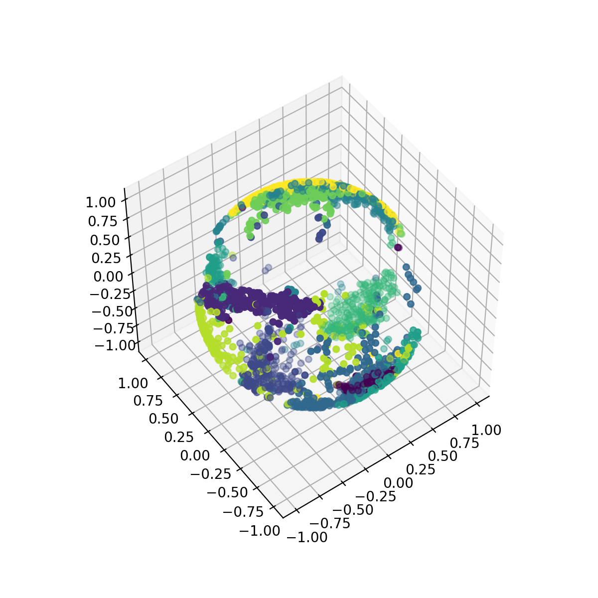

# beesnees
Bregman E Ergodic Stochastic Neighbourhood Embedding E Sphere

A t-SNE like algorithm for finding a projection onto a sphere.

Heavily based on the [python code](https://lvdmaaten.github.io/tsne/code/tsne_python.zip)
by Laurens van der Maaten and the [matlab code](https://github.com/yaolubrain/DOSNES)
by Yao Lu.

Here is the projection of 2500 digits of MNIST (from Laurens van der Maaten's code archive).



## Example

```
python pca.py
python beesnees.py
python show_sne.py
```

```beesnees.py``` is a pure python implementation that projects from 50 dimensions to 3 dimensions.
```pca.py``` requires scikit-learn, and ```show_sne.py``` requires matplotlib with mplot3d.

## References
- Laurens van der Maaten, Geoffrey Hinton, "Visualizing Data using t-SNE", JMLR 9, 2008
- Yao Lu, Zhirong Yang, and Jukka Corander, "Doubly Stochastic Neighbor Embedding on Spheres"
  https://arxiv.org/abs/1609.01977
